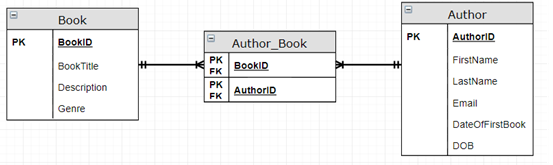

[Intro](./README.md) | [Getting Started](./Getting%20Started.md) | [Tasks](./Tasks.md) | [SQL Basics](./sqlbasics.md)

# Tasks to complete:

1. SQL Key Terms
   - Create a table to store the details of the following keywords and their definitions, add additional rows as needed.
     
        | **Key Term**        | **Meaning/Definition** |
        |---------------------|------------------------|
        | Data                |                        |
        | Information         |                        |
        | DBMS                |                        |
        | Relational Database |                        |
        | Primary Key         |                        |
        | Foreign Key         |                        |
        | Data Redundancy     |                        |
        | Data Integrity      |                        |
        | DDL                 |                        |
        | DML                 |                        |
        | ...                 |                        |
   - Create a table to store the details of different DataTypes and an example of what can be stored within them
     
        | **DataType**         | **Data that can be Stored** |
        |----------------------|-----------------------------|
        | Integer              |                             |
        | Float                |                             |
        | VarChar              |                             |
        | Datatime             |                             |
        | ...                  |                             |
     

#### Before you continue, be sure you have started the database ([Getting Started](./Getting%20Started.md))

2. Creating Databases and Tables
   - Task 1: Create a new database called RelationalTest
   - Task 2: Create the following tables
      - Customer
           - ID
           - FirstName
           - Surname
      - Order
           - ID
           - OrderDate
           - ProductID
           - CustomerID
           - Quantity
           - OrderValue
      - Product
           - ID
           - ProductName
           - Price
   - Task 3: Identify how you would link the above three tables together and set the primary and foreign keys appropriately

([SQL Basics](./sqlbasics.md))

3. Intro to SQL
   - Run the SQL script for the [Sales Database](./Resources/Sales_db_script%20(MySQL).sql) which can be found in the Resources directory
   - Using the Sales database write SQL for the following queries
      - Show all the details for all the customers
      - Count how many customers live in London
      - Insert yourself as a customer
      - Insert a new order for yourself
      - Update the salesman James Hook as he has now moved to Rome
      - Update the customer Jane Davis to be Jane Black as they have gotten married
      - Delete your order from the order table
      - (extension) Using a JOIN show all the order details for all customers
      - (extension) Using a JOIN, show all the order details for all customers
      - (extension) Sort the results of the previous query by order date, newest order first!
      - (extension) Using a JOIN, show all order details for all orders placed by Brad Davis
      - (extension) Add to the previous query so that it shows the name of the salesman
      - (extension) Using GROUP BY, display how many orders each salesman is responsible for

4. SQL Queries 1
   - Run the SQL script for the  [Stock Database](./Resources/stock_script%20(MySQL).sql) which can be found in the Resources directory
   - Using the Stpck database write SQL for the following queries
      - Insert a new Supplier into your Database
      - Insert a new Customer
      - Insert a new camera product, supplied by the Supplier inserted above
      - Insert a new Laptop into ‘Products’
      - Insert a new Keyboard into ‘Products’
      - Insert yourself as a Customer
      - Insert a new Order for yourself for one of the new laptops
      - Display the Title, Forename and Surname of the customers in the database
      - Display the name and telephone number of the suppliers in the database
      - Display ALL the information held in the database about the customers
      - Display all the unique Titles of the customers in the database.  Each title should only be shown once in the results.
      - Display all the unique categories of products that we have in the database.  Each category should only be displayed once.
      - Display ALL details of all customers whose credit limit is £1000
      - Display the order number of all orders where more than one item has been ordered.
      - Display the product number and description of all products supplied by the Supplier with Supplier Number 2 ONLY
      - Display how many customers there are in the database
      - Display how many customers have the title ‘Mr’
      - Display how many products there are in the ‘Cameras’ category
      - Display the name and address details of all customers with a credit limit of £2000
      - There is a quality issue with a product.  The company needs to see how many orders there are for the product with Product Number 'AE424747’.  Write this query.
      - Following on from the last query, now display the details (e.g., order number, order date) of the orders for the product with Product Number 'AE424747’.  
      - Display all details of products where the quantity in stock is less than the re-order level
      - Find out how many products there are with a Product Number starting with ‘AF’
      - Display all details of all customers whose surname starts with the letter ‘W’
      - Display the Product Number, Description and Price of all FIREWALL products

5. Recap Activity
   - Create the database pictured in the design below including appropriate datatypes, primary and foreign keys and appropriate constraints.

6. SQL Update
   - Using the Stock database write SQL for the following queries
      - Change the first name of Rev Rob Girling to ‘Robert’
      - Ms Jeannie Cook has now married and become Mrs Jeannie Burton.  Update her customer record accordingly.
      - Update the address of one of your customers (i.e. to simulate that they have moved to a new house).
      - A delivery of 30 Diablo 207 Network Cameras has arrived.  Update the current stock level in the database.   Be careful to increase the quantity not just set it to 30.
      - Add £10 to ALL product prices.  Be careful to increase the price not set them all to £10!
      - Delete the order in the system from Customer with Customer Number 455
      - Delete the Supplier with Supplier Number 2 from your database.  
         - Was this possible?  If not, why is it not?
   - Write an SQL script for the Stock database that:
      - Creates another table in your database (give it any name).  
      - Uses INSERT commands to add a couple of test records.
      - Then, deletes these test records. 
      - Then deletes the table itself.

7. Joins
   - Using the Stock database write SQL for the following queries
      - Display the Product Number, Product Description and Supplier Name for all products.
      - For every order, display the order details AND the details of the product that has been ordered.
      - By using one SQL query, display the Order Numbers and Product Numbers for all orders placed by Mrs Leah Barlow.
      - Display the Product Number, Supplier Name and Product Description of all products where the current number in stock is less than 10.
      - Add to the query above to also display the Order Number and Order Quantity of any orders that have been placed for these items (i.e. orders that have been placed for the products with less than 10 in stock).
      - Use an outer join to show the details of all the products that have not yet been ordered.

8. Calculated Fields
   - Using the Stock database write SQL for the following queries
      - Create a query that for a particular order number, shows the items that have been ordered, the price of each item that is in the database (which include VAT), and the price of each item excluding VAT.  Note that the latter will need to be a calculated field.
      - Write a query that uses a calculated field to display the total amount payable for each product on each order (i.e. the price of each product multiplied by the quantity).
      - An important customer has rung up. They placed an order (376805), but having received the products, they are not satisfied with the quality or reliability of the items. Using this order number, write a query that finds the item number for this order – and then saves this item number to a variable. You should then PRINT the variable to the screen so that it is visible when the query is executed.
      - Continuing on from the query above:- Because the item in question is an expensive product, and there are serious concerns over the quality of this stock, management have made the decision to temporarily remove this item from sale. Extend the query from above, so that the item number saved to a variable is used in an UPDATE query to modify the items stock level to 0 (zero).  This will ensure that no more of this item can be ordered temporarily.

9. Functions
    - Using the Stock database write SQL for the following queries
       - What is the average price of an item in our database
       - What is the total value of all of the items that in stock
       - When was the earliest order placed in our database
       - Currently we are using VARCHAR(100) to store the product descriptions.
       - A manager is wondering whether we could ‘alter’ this table to reduce this to varchar(50). rite a query that shows what it would be like if we only stored up to the first 50 characters of each product description.
          - Do you think that 50 characters would be enough?
       - For every order in the database, display how many days ago the order was placed.
       - Who would be the customer with the most characters in their combined first name and surname

